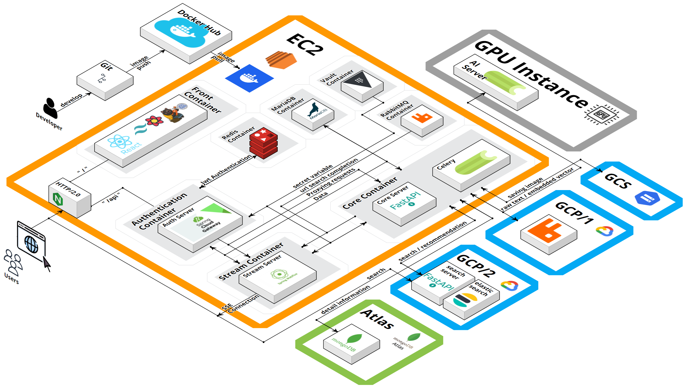
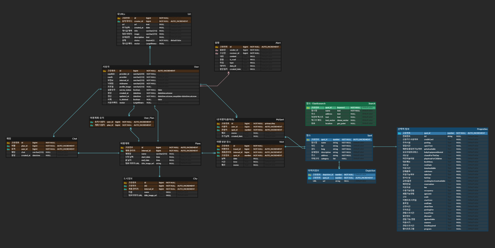

# What is Fastravel?

  

# Work Team

### Front-end Team

|                                     이우성                                      |                                      김형규                                      |                                      이준수                                      |
| :-----------------------------------------------------------------------------: | :------------------------------------------------------------------------------: | :------------------------------------------------------------------------------: |
|  |  |  |
|       `Frontend Leader` [@leewooseong](https://github.com/leewooseong)       |          `Frontend` [@kim-hyunggyu](https://github.com/kim-hyunggyu)          |            `Frontend` [@JUNSUTARO](https://github.com/junsutaro)             |

### Back-end Team

|                                                                     신창엽                                                                     |                                     이재민                                      |                                                이우경                                                |
| :--------------------------------------------------------------------------------------------------------------------------------------------: | :-----------------------------------------------------------------------------: | :--------------------------------------------------------------------------------------------------: |
|                                                                 |  |                       |
|                                           `PM` `DevOps` [@404](https://github.com/404-not-foundl)                                           |            `Back Dev.` [@JaeMin Lee](https://github.com/Chosamee)            |                          `AI Dev.` [@Lee](https://github.com/Lee-search)                          |
| CI/CD Infra [Authentication Server](https://github.com/fast-boys/authentication) [Stream Server](https://github.com/fast-boys/stream) |                [Core Server](https://github.com/fast-boys/core)                 | [AI Server](https://github.com/fast-boys/ai) [Search Server](https://github.com/fast-boys/search) |

  

# Develop Environment

### Frontend

### Authentication Server

### Core Server

### AI Server

### Search Server

### Stream Server

### DataBase

### Infra

  

# Main Services

<table>
  <tbody>
    <tr>
      <td align="center" valign="top" width="25%" > <b>1. 로그인, 로그아웃</b> 
      카카오 및 구글 계정을 이용하여 서비스에 로그인 및 로그아웃 기능을 이용할 수 있습니다.
      </td>
      <td align="center" valign="top" width="25%" > <b>2. 설문조사 페이지</b> 
    서비스를 처음 이용하는 사용자라면 설문조사를 통해 선호도를 조사를 수행합니다. 설문 조사에서는 3개의 장소를 선택할 수 있으며 마음에 드는 장소가 없다면 새로고침을 통해 새로운 장소들을 받아올 수 있습니다.
      </td>
      </tr>
      <tr>
      <td align="center" valign="top" width="25%" > <b>3. 메인 페이지</b> 
      메인 페이지에서는 추천 여행지, 주변 여행지, 인기 여행지를 추천 받아볼 수 있습니다. 
    또한 헤더를 통해 새로운 여행을 생성할 수 있고, 여행 정보와 관련된 블로그 글 url을 추가할 수 있습니다. 
      </td>
      <td align="center" valign="top" width="25%" > <b>4. 여행 생성, 수정, 삭제</b> 
      일정 생성 버튼을 통해 도시, 날짜, 여행 프로필을 작성하고 일정을 생성할 수 있습니다. 생성된 일정은 마이 페이지에서 확인 가능하며 해당 페이지에서 일정을 수정, 삭제할 수 있습니다.
      </td>
    </tr>
        <tr>
      <td align="center" valign="top" width="25%" > <b>5. 상세 일정 작성</b> 
      생성한 일정을 클릭해서 상세 일정을 작성할 수 있습니다. 해당 페이지에서는 생성 시 선택했던 지역 기반으로 여행지를 추천받을 수 있으며, Day Select 버튼을 통해서 여행 계획을 일차별로 이동할 수 있습니다. 장소 세부 페이지 및 검색을 통해서 여행지를 추가하고 edit 버튼을 이용해서 일정을 수정할 수 있습니다.</td>
      <td align="center" valign="top" width="25%" > <b>6. 여행 일정 페이지 - 일정 조회하기</b> 
       작성 및 수정이 완료된 여행 일정을 조회하는 페이지로, 각 날짜 별로 방문할 여행지들의 목록을 볼 수 있습니다.
      </td>
      </tr>
      <tr>
      <td align="center" valign="top" width="25%" > <b>7. 여행 일정 페이지 - 일정 수정하기</b> 
      일정 작성하기와 마찬가지로 일정을 수정할 수 있습니다. edit 버튼을 누르면 해당 일장의 여행지를 전체 선택하여 수정이 가능합니다.
      </td>
      <td align="center" valign="top" width="25%" > <b>8. 여행지 세부 페이지</b> 
      여행지에 대한 상세정보를 확인할 수 있는 페이지로 여행지의 사진 및 설명, 위치를 확인할 수 있습니다. 마음에 드는 여행지라면 좋아요를 통해 내 여행지 목록에 추가할 수 있으며 일정 추가를 통해 여행 일정에 해당 여행지를 추가할 수 있습니다.
      </td>
    </tr>
    <tr>
      <td align="center" valign="top" width="25%" > <b>9. 검색</b> 
      검색을 통해 여행지를 검색할 수 있습니다. 단어 일치에 대해 자동 완성을 제공하며, 자동 완선에서는 초성 검색, 영문 오타 검색을 지원합니다.
      </td>
      <td align="center" valign="top" width="25%" > <b>10. 마이페이지</b> 
      작성한 여행 일정 및 내 여행지 정보를 확인 가능하며 해당 메이지를 통해 일정 수정, 삭제 및 여행지 좋아요 취소, 메모 작성 작업을 수행할 수 있습니다. 우측 상단의 정보 관리 버튼을 통해서 프로필 정보를 수정할 수도 있습니다.
      </td>
    </tr>
    <tr>
      <td align="center" valign="top" width="25%" > <b>11. URL Book 페이지</b> 
      추가한 url을 기반으로 url을 분석하여 url 별 블로그 내용과 유사한 여행지들을 제공 받을 수 있습니다. 유효하지 않은 URL이나 크롤링이 금지된 사이트의 경우 추천 불가능한 URL로 들어가게 됩니다. 분석이 끝나 URL이나 실패한 URL들은 삭제할 수 있습니다.
      </td>
    </tr>

  </tbody>
</table>

  

# Service Architecture

  

# ER Diagram

